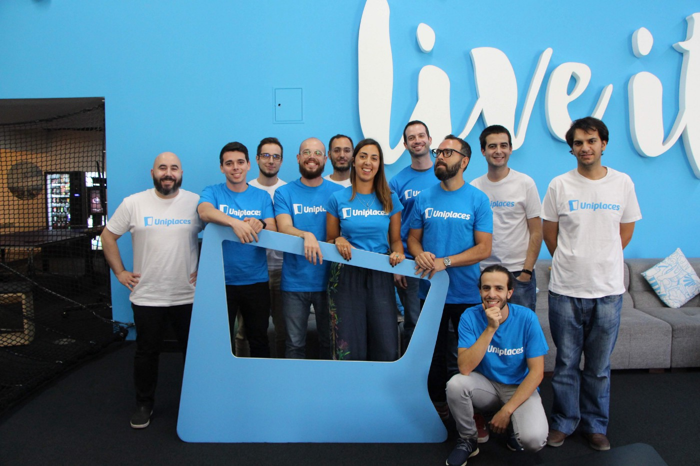

Next year I’m celebrating 4 years at Uniplaces. I had 3 long, long years that represent an amazing journey in my life.
There are so many moments I will remember forever, many positive ones, few negative ones, a lot of excitement and 
huge growth, both from a personal and professional perspective. 
There are very few things I regret and I’m honestly proud of that.
There is one big thank you that goes to the people in our team. They and their passion, willingness, 
and fighting spirit are what makes the tech island a sweet home for me.

If you want to be part of our team, don’t forget we are hiring:

* https://careers.uniplaces.com/o/software-engineer-devops-lisbon
* https://careers.uniplaces.com/o/software-engineer-fullstack
* https://careers.uniplaces.com/o/site-reliability-engineer-sre

---
