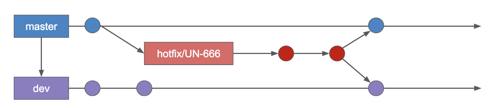
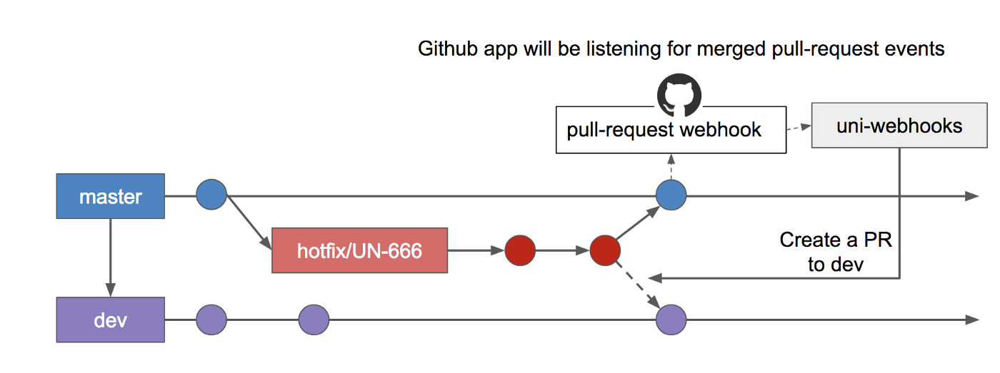
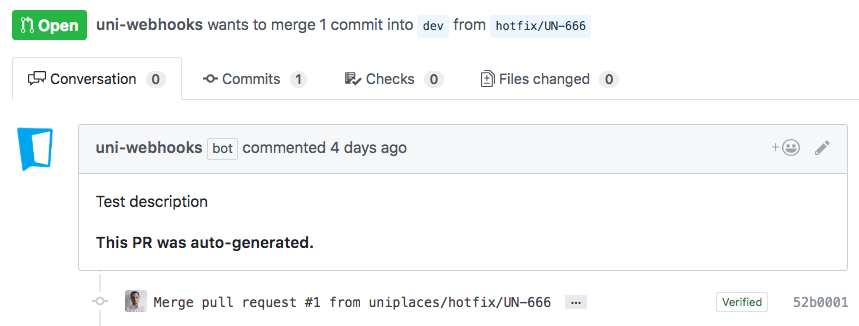

At [Uniplaces](https://www.uniplaces.com) we use git-flow almost since the beginning. At first we started with basic:
* dev branch for staging environment
* master for production
* feature branches for new features (based on dev branch)

P.S.: If you don’t know or aren’t familiar with git-flow, you should stop here are read:
* https://medium.com/@nuno.caneco/using-git-flow-243581525aee
* https://danielkummer.github.io/git-flow-cheatsheet/

After a while we wanted to increase our agility and reduce the time that took us to fix important bugs in our systems, and we decided to introduce the hotfix concept.
Hotfixes are created based on master branch and then merged both to development & master.

#### Git-flow hotfixes can’t be reviewed
This flow works quite well for smalls teams where everyone knows what other people are doing, but for medium/large 
teams hotfixes create a bypass to Pull-requests which is one of our most important step of our development lifecycle. 
It’s important that even for small fixes, a second pair of eyes have a look into it.
To do this, it we needed create the hotfix branch based on master as normal, and instead of finishing the hotfix 
and merge to master & development branches it was require to:
Create the pull-request from the hotfix to master branch.
If the previous pull-request is approved, the developer would need to do the same for development branch: 
Create the pull-request pointing the hotfix to development branch.
This second step, was making me feel bad as a engineer. We are suppose to simplify processes, not to create more entropy.
I decided then, to create a GitHub application bot to receive Github webhooks and automatically create the second 
PR (hotfix->development branch).

#### Automating hotfixes pull-requests
To automate hotfixes, we created a github application. This application will require to have access 
to [pull-request events](https://developer.github.com/v3/activity/events/types/#pullrequestevent).

This github application will dispatch the pull-request event as a webhook to our uni-webhook bot to handle that request 
and create the same pull-request to development branch if the PR event is defined as closed & merged.

We will see in detail, how to create the github application and the uni-webhook bot on the next part of this story.

---
