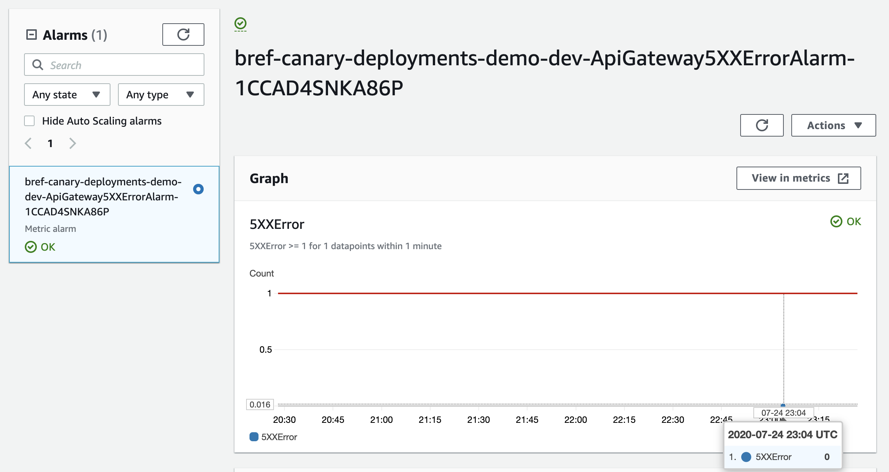
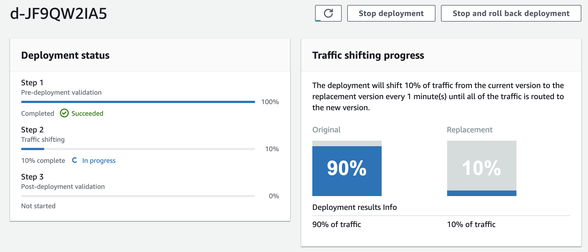

Serverless computing is a cloud-based execution model that enables applications to be hosted as a service, 
without the need to maintain a server. Serverless & Lambda functions have become very popular in 
Cloud infrastructures from small to enterprise companies.

In this example will we are going to deploy a Symfony application (PHP) to AWS Lambda, using the following stack:

- [Bref](https://bref.sh/)
- Serverless Framework + serverless-plugin-canary-deployments

On top of the classic PHP on AWS Lambda setup, this example will also configure AWS CloudWatch alerts and 
setup CodeDeploy to manage Blue/green canary deployments based on errors that are monitored using AWS CloudWatch.

<hr/>

#### Create our Symfony app:
`symfony new bref-canary-deployments-demo` 

#### Install Bref:
`composer req bref/bref`

Learn more on how to setup a Symfony app here: https://bref.sh/docs/frameworks/symfony.html

I'm not going to focus on how to setup the Symfony application with Bref. If you have doubts or issues, you should follow the
official documentation.

#### Deploy:
`sls deploy`


Under the wood, these steps have created the following infrastructure:
* AWS Lambda function with a custom PHP layer managed by Bref.
* An API Gateway

Until here, nothing new. This is a typical Serverless application, independent if you are deploying a PHP (customer layer)
or a native AWS supported runtime (eg: NodeJS) you should relate to these steps and configurations.

Now we are going to setup the blue/gree deployments with gradually traffic shifting and automatic rollback.

#### Install serverless-plugin-canary-deployments:
`npm i --save-dev serverless-plugin-canary-deployments`

Enable `serverless-plugin-canary-deployments` on serverless framework configuration:

```yaml{5}
#serverless.yml

plugins:
  - ./vendor/bref/bref
  - serverless-plugin-canary-deployments

# ...
```

#### Configure the gradually traffic shifting:
The new `deploymentSettings` will configure AWS CodeDeploy according to the defined `type` to deploy our Lambda 
while the traffic is shifted in equal increments with an equal number of minutes between each increment. 
In our example: `Linear10PercentEvery1Minute` - Shift 10 percent of the traffic, every 1 minute.
You can read more on the different Deployment Types here: https://docs.aws.amazon.com/serverless-application-model/latest/developerguide/automating-updates-to-serverless-apps.html

```yaml{12-14}
#serverless.yml

functions:
  website:
    handler: public/index.php
    timeout: 28 # in seconds (API Gateway has a timeout of 29 seconds)
    layers:
      - ${bref:layer.php-74-fpm}
    events:
      -   http: 'ANY /'
      -   http: 'ANY /{proxy+}'
    deploymentSettings:
      type: Linear10PercentEvery1Minute
      alias: Live
      alarms:
        - ApiGateway5XXErrorAlarm

resources:
  Resources:
    ApiGateway5XXErrorAlarm:
      Type: 'AWS::CloudWatch::Alarm'
      Properties:
        AlarmDescription: 'Api Gateway server-side errors captured'
        Namespace: 'AWS/ApiGateway'
        MetricName: 5XXError
        Dimensions:
          - Name: ApiName
            Value: ${self:provider.stage}-${self:service}
        Statistic: Sum
        Period: 60
        EvaluationPeriods: 1
        Threshold: 1
        ComparisonOperator: GreaterThanOrEqualToThreshold
```

On the following lines, we define and configure AWS CloudWatch to monitor our Lambda or API Gateway
that AWS CodeDeploy will use as Threshold to decide if it should rollback or not the current deploy.

```yaml{18-33}
#serverless.yml

functions:
  website:
    handler: public/index.php
    timeout: 28 # in seconds (API Gateway has a timeout of 29 seconds)
    layers:
      - ${bref:layer.php-74-fpm}
    events:
      -   http: 'ANY /'
      -   http: 'ANY /{proxy+}'
    deploymentSettings:
      type: Linear10PercentEvery1Minute
      alias: Live
      alarms:
        - ApiGateway5XXErrorAlarm

resources:
  Resources:
    ApiGateway5XXErrorAlarm:
      Type: 'AWS::CloudWatch::Alarm'
      Properties:
        AlarmDescription: 'Api Gateway server-side errors captured'
        Namespace: 'AWS/ApiGateway'
        MetricName: 5XXError
        Dimensions:
          - Name: ApiName
            Value: ${self:provider.stage}-${self:service}
        Statistic: Sum
        Period: 60
        EvaluationPeriods: 1
        Threshold: 1
        ComparisonOperator: GreaterThanOrEqualToThreshold
```
#### (Re)Deploy:
`sls deploy`

After you initiate a second deploy, it will create an additional set of resources on AWS:
* An Alarm on AWS CloudWatch
* An Application on CodeDeploy

<figure>
  
  <figcaption>CloudWatch Alarm</figcaption>
</figure>

**Important:** We choose to setup our Alarm for API Gateway errors instead of using directly the lambda error metrics.
This happen, because Lambda Errors don't include the application exceptions/errors, 
because most of the time this is handle by the Framework (eg: Symfony) or even the language itself.
Lambda errors will only take into account errors that break the runtime (eg: PHP).
This is why, we decided to use API Gateway error metrics instead, but you can and should monitor both.

This new deploy will show up on AWS CodeDeploy:


<figure>
  
  <figcaption>CodeDeploy - Deploy in Progress</figcaption>
</figure>


<figure>
  
  <figcaption>CodeDeploy - Traffic Shifting</figcaption>
</figure>

At the same time, we can also follow up on the traffic shifting progress and if we want, 
we can also manually _Stop and rollback_ the deployment.
During this moment if our API Gateway Alarm detect any error, the deployment will 
be **automatically** rollback by AWS CodeDeploy.

This process and configuration is a great way to deploy and monitor your Serverless applications but also
to automate the rollback process on a CI/CD pipeline.

---
