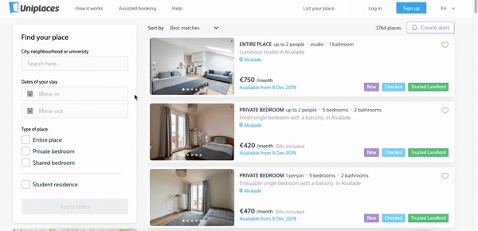

## Changing city within the search results

There's another brand new release on search for desktop. We can, from now on, search for any city, neighborhood or university inside the search page.

That's right, no more changing the URL/going back to the homepage when you want to search another city: just type in what you're looking for, and off you go. These changes can be seen both on the listings and map view. 🏚

We hope this is as useful for our tenants as it is for us. 

Uniplaces Product Team

---

