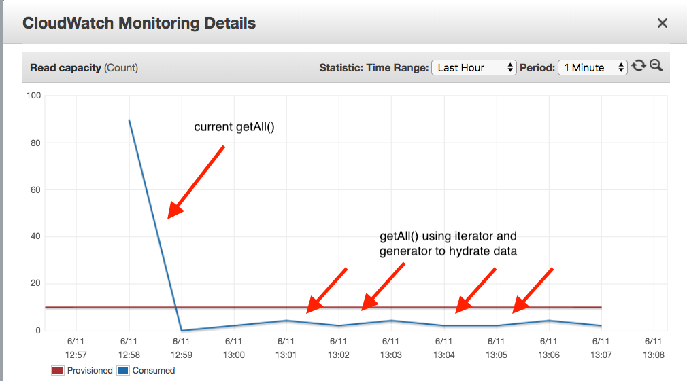

Sometime ago I wrote [DynamoDb on Demand Hydrator](/dynamodb-on-demand-hydrator/), where I show how to implement a 
custom PHP Collection where you receive an iterator and an custom hydrator, each element of the iterator will be then 
hydrated on each collection iteration.
This implementation, works fine but it requires a custom collection implementation with two dependencies (iterator & hydrator).
If you are familiar with AWS DynamoDB client for PHP they already do the hard work of handling multiple paginated 
results using the ResultPaginator.
This means, that we just need to find a way to “hook” into the iteration process itself and call our hydrator. 
Simple, but not that easy to achieve at first sight.
Generators in PHP are great for these type of problems. They allow you to yield the field as you iterate and still 
return an Iterator as a return type.

```php

class ExampleRepository extends DynamoDbRepository
{
    //more code...
    
    public function getAll(): iterable
    {
        $parameters = ['TableName' => $this->finalTableName()];
        $iterator = $this->client()->getPaginator('Scan', $parameters)->search('Items');
        foreach ($iterator as $item) {
            yield $this->hydrator()->hydrate($item);
        }
    }
}
````

The client() call returns a AWS DynamoDB client that will perform our scan, handle the paginated results 
and will perform the requests o DynamoDB as it needs. 
Then, on lines 12–14, we are creating a generator that will iterate and hydrate on demand our results and yield them 
to be iterated over to everyone who call ExampleRepository::getAll() method.
Note that, as we are using > PHP 7.1 we can define iterable as a return type, which is great because it allow us to 
match our Iterator return type on this ExampleRepository but also would be compliant with anything that could be 
iterable (such as an array) as in an InMemoryRepository implementation for example.
Another great feature of using AWS DynamoDB ResultPaginator iterator, is that they are compatible with PHP SPL Iterators. 
So if you need to implement a getAll that allow you to limit the amount of the returns returned, 
you can wrap the returned iterator with a \LimitIterator as you can see in the next example:

```php
class ExampleRepository extends DynamoDbRepository
{
    //more code...
    
    public function getAll(int $limit = null): iterable
    {
        $parameters = ['TableName' => $this->finalTableName()];
        $iterator = $this->client()->getPaginator('Scan', $parameters)->search('Items');
        
        if ($limit != null) {
            $iterator = new \LimitIterator($iterator, 0, $limit);
        }

        foreach ($iterator as $item) {
            yield $this->hydrator()->hydrate($item);
        }
    }
}
```

This approach have proven to be not just very efficient in memory but also allow us to process items in a 
more dispersed way and thereafter distribute the consumed capacity units through time.


---
