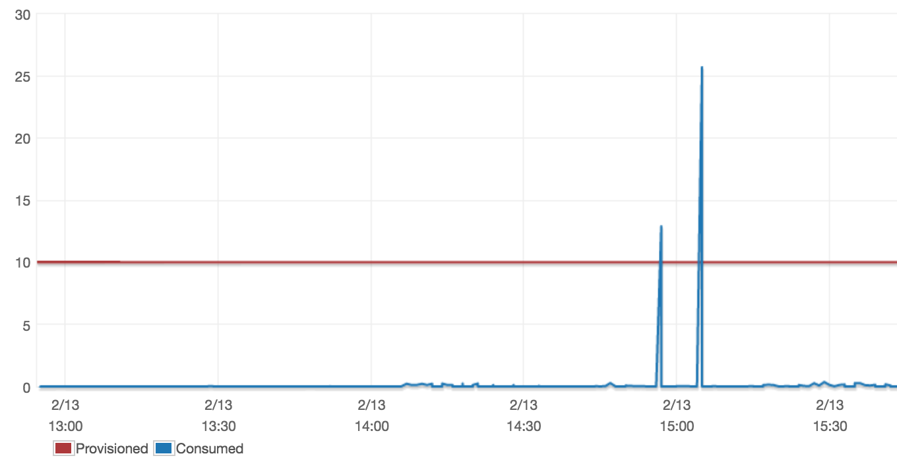
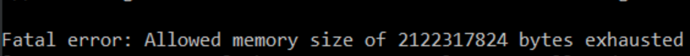

At Uniplaces we use a DynamoDB as our main database. DynamoDB is NoSQL and distributed database from Amazon webservices 
that automatically spreads the data and traffic for the table over a sufficient number of servers to handle the request 
capacity specified by the customer and the amount of data stored, while maintaining consistent and fast performance. 
But, as everything in engineering, DynamoDB and other distributed databases come with lots of trade-offs.

### The problem:
As a startup we started with the [KISS](https://en.wikipedia.org/wiki/KISS_principle) principle:
To get a collection of items or scan an entire table we just had to ask the data to DyanmoDB and then we hydrate each 
of the items to a Domain object. This worked, and everyone was happy. At least for a while. Like Uniplaces, those tables 
grow (a lot!) and after some time, we started to notice two problems:

1) Big scans can exceed our throughput.

2) During the hydration process: the cost of hydrating 1 item or 100000 + 1 was exponential and not linear as expected.

On the first point, we were requesting a huge amount of data in a same short period of time, making our consumed 
capacity overtake our provisioned capacity.
The second problem is a little bit more complex. Its was the outcome of a slow hydration for big sets and in worst 
cases resulted in an “Allowed memory size … exhausted” error. Every time we fetched data, we were allocating the full 
dataset and building the same representation in objects, this process was slow and require a huge amount of system resources.

At this point was obvious that we were handling scans in the wrong way and we needed to come up with a solution.
Lucky, the new AWS SDK for PHP return an Iterator that automatic handles paginated results, and will perform the necessary requests of new items when the next() is called. In this example, I called it OnDemandCollection.

This technique allow us to reduce the amount of memory and also scatter the consumed capacity along each iteration.

If you love filters as we do, you probably want to check [House rules on search](/house-rules-on-search/). 

---
