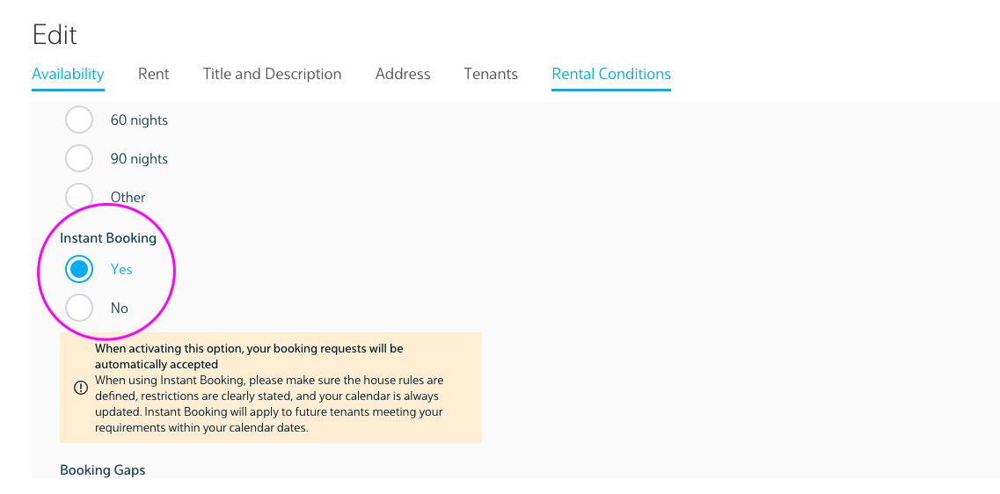

This quarter brought us a lot of surprises. One of those is this release, something that was long due. The instant booking feature is present on our website for quite some time, applied only to Uniplaces exclusive offers.

We've decided we wanted to check it's value proposition for all landlords. 💡

From now on, landlords can apply the instant booking feature to their own offers, through their dashboard. While editing their offers, they can select it under the rental conditions tab. 👌

So what is exactly an instant booking? If an offer is selected as one, the booking will be automatically accepted if a tenant sends a booking request. For that, of course, our landlords should make sure their house rules are well defined, restrictions are clearly stated and with an updated calendar.

Also, after they select this, they can also choose if they want to apply booking gaps on their accounts (gap on bookings). These two features are super well described so our landlords can understand exactly what they're choosing on selection. 

After some weeks of testing this feature, we are actually having great results. However, since not a month as gone by, depending on future results we may ponder new iterations for this feature. ✅

Uniplaces Product Team 🍁

---
