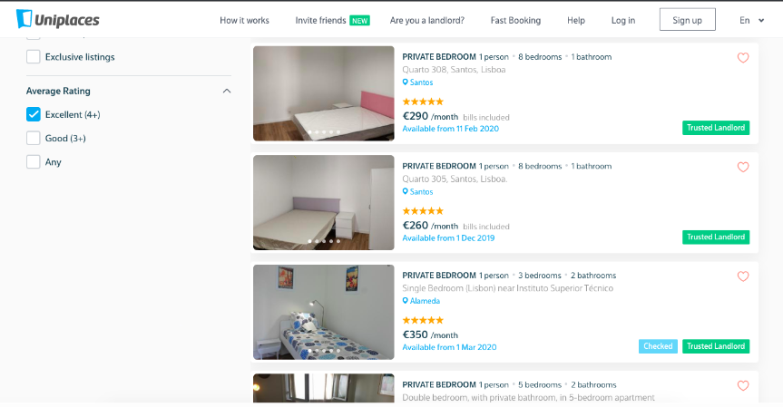
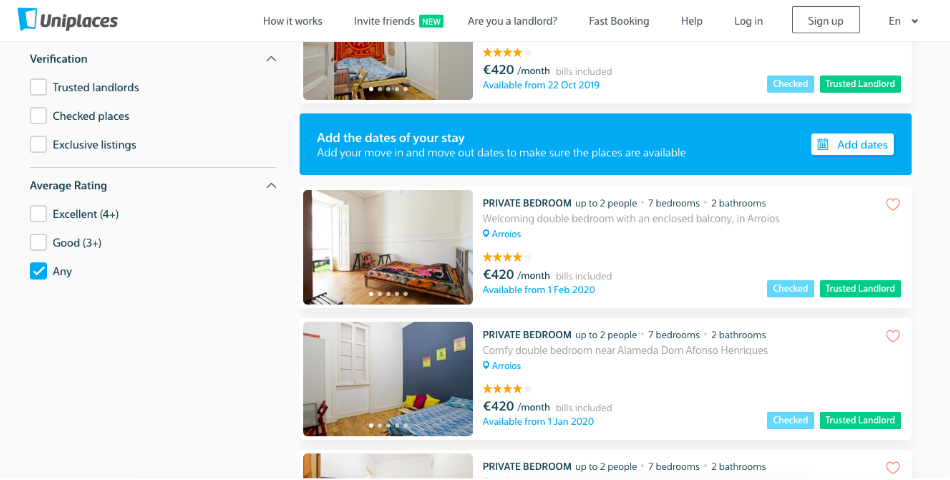

Recently, we had a new search-related release. This one is tied to the fact that we want to reward our reviewed offers, especially the highest-rated ones. ⭐️⭐️⭐️⭐️⭐️

From now on, our tenants can filter their search results by offers with an Excellent rating (4+ stars), Good rating (3+ stars) or any offer that was already reviewed/rated in the past.

This can only be seen on desktop and will be added to our mobile version and app pretty soon.

With this release, we are hoping there's a push for more reviews, as it's such an important step on a search for a new home, for so many people.🏡

Thank you for your time!

Uniplaces Product Team

If you love filters as we do, you probably want to check [House rules on search](/house-rules-on-search/). 

---
