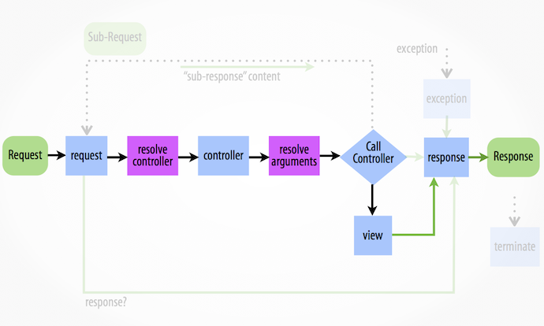

Recently we have changed our payment system at [Uniplaces](https://www.uniplaces.com). Some of payment providers are asynchronous to confirm the 
payment charge (e.g. bank transfers). To handle this asynchronous process we rely on Stripe webhooks to confirm payments. 
When we receive a payment confirmation we need to be sure that the request is actually coming from Stripe and not from 
somewhere else trying to confirm a payment that didn’t exist. To archive this, we needed to add an extra security layer 
to validate all the webhooks requests.

Usually, you would use a Middleware (e.g. [Laravel middleware](https://laravel.com/docs/5.4/middleware), 
[HandlerFunc in Golang](https://golang.org/pkg/net/http/#HandleFunc), etc) to tackle this type of problems. 
Symfony doesn’t use middleware architecture, instead, it uses Kernel Events 
to allow developers to hook into the Request->Response workflow.

The [HttpKernel component](http://symfony.com/doc/current/components/http_kernel.html) provides an interface that formalizes the process of starting with a request and 
creating the appropriate response.

Internally this handle function is responsible for transforming the Request into the Response following the 
previous workflow. In each step, Symfony will dispatch an event that can be listened by multiple listeners.

### Stripe Request Subscriber
Our task is simple. Create our listener to validate Stripe requests and subscribe it to correct kernel event.
As Symfony documentation describe in their website for 
[kernel.request event](http://symfony.com/doc/current/components/http_kernel.html#the-kernel-request-event):

> Typical Purposes: To add more information to the Request, initialize parts of the system, or return a Response 
if possible (e.g. a security layer that denies access).

This is a perfect fit for our use case because, we want to deny access for requests that don’t come from Stripe.
Lets create our Subscriber and subscribe it to `KernelEvents::REQUEST` Event and define what method do we what to execute 
`onKernelRequest()`.

Behind the scenes, the `validateWebhook()` implementation is using the `\Stripe\Webhook::constructEvent` from 
[Stripe SDK](https://stripe.com/docs/webhooks#verify-official-libraries) to validate the request header signature.

---
